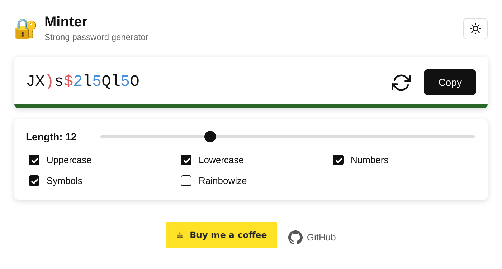
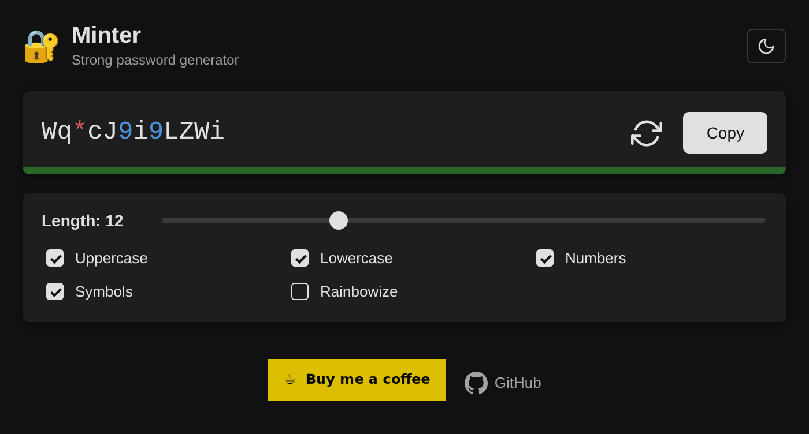

# Minter — Password Generator

A browser extension for Chrome that generates strong, customizable
passwords directly from your toolbar. No account needed, works
entirely offline.

## Features

- Adjustable length from 4 to 32 characters
- Toggle uppercase, lowercase, numbers and symbols
- Optional rainbow coloring
- Live password strength meter
- One-click copy to clipboard
- Dark / light / system theme

## Screenshots

| Light | Dark |
|-------|------|
|  |  |

## How to install (developer mode)

The extension is not listed in the Chrome Web Store. You can install it
manually in a few steps:

1. Download this repository — click **Code → Download ZIP** and unzip it
2. Open Chrome or Edge and go to `chrome://extensions`
3. Enable **Developer mode** (toggle in the top right)
4. Click **Load unpacked**
5. Select the `password-extension` folder

The Minter icon will appear in your browser toolbar.

## Usage

1. Click the Minter icon in your toolbar
2. Adjust length and character types to taste
3. Click the refresh icon to generate a new password
4. Click **Copy** to copy it to your clipboard

## Support

If you find Minter useful:
[☕ Buy me a coffee](https://buymeacoffee.com/hoolite)
